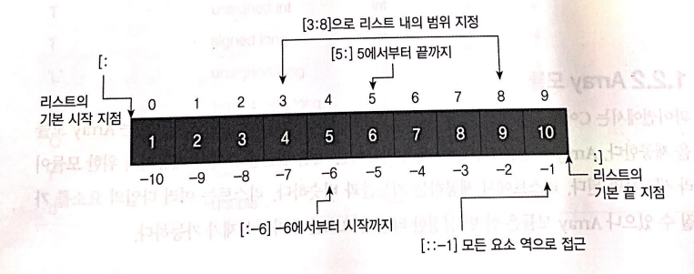

배열
--------------------

## 1.1 배열이란?<br/>
연속적인 메모리 공간에 저장된 아이템의 집합을 표현하는 **자료구조**<br/>
파이썬에서 배열 사용 방법으로는 리스트(여러 타입을 하나의 자료구조에 담을 수 있음)와 Array(초기화 하는 시점에 정해진 하나의 타입만) 모듈이 있다<br/>

## 1.2 파이썬에서 배열(리스트 사용법)<br/>
### 1.2.1 리스트(List)
여러 타입의 요소를 가질 수 있음
- 리스트 초기화
```python
py_list_empty=[]
py_list=[1,2,3,4,5]
# 0을 10개 가지는 리스트 초기화
py_list_zeros_1=[0 for i in range(10)]
py_list_zeros_2=[0]*10
```

- 리스트 요소 추가 및 삭제
```python
# 추가 - append() 
py_list=[1,2,3,4,5]
py_list.appned(6)   #[1,2,3,4,5,6]
py_list_1=[1,2,3]
py_list_2=[4,5,6]
py_list_1.append(py_list_2) #[1,2,3,[4,5,6]]

# 확장 - extend()
py_list_1=[1,2,3]
py_list_2=[4,5,6]
py_list_1.extend(py_list_2) #[1,2,3,4,5,6]

# 추가 - insert()
py_list=[1,2,3]
py_list.insert(3,4) #3번째 위치에 4 요소를 추가한다 [1,2,3,4]

# 삭제 - remove()
py_list=[1,2,3,2,4]
py_list.remove(2)   # list에는 중복된 값이 있을 수 있고 여러 값들 중에 가장 앞선 인덱스의 요소가 삭제[1,3,2,4]

# 삭제 - clear()
py_list=[1,2,3]
py_list.clear() #[]

# 삭제 - del
py_list=[1,2,3]
del py_list[1]  #[1,3]
```
- 리스트의 요소 접근<br>
파이썬에서는 인덱스로 접근하는 방법과 슬라이싱으로 잘라 접근하는 방법도 제공

```python
py_list= [1,2,3,4,5,6,7,8,9,10]
py_list[9] #10
py_list[-1] # 10
py_list[3]  # 4
py_list[-7] # 4
```
- 슬라이싱 방법<br/>
<br/>
```python
py_list= [1,2,3,4,5,6,7,8,9,10]

py_list[3:8]    #[4,5,6,7,8]
py_list[5:]     #[6,7,8,9,10]
py_list[:-6]    #[1,2,3,4]

# 콜론 연산 2개를 사용시 마지막은 스텝으로 사용
# 리스트를 역순으로 얻어올 수 있도록 한다
py_list[::-1]   #[10,9,8,7,6,5,4,3,2,1] 
```

### 1.2.2 Array 모듈
파이썬에서는 배열 접근을 단순히 래퍼(Wrapper)하여 지원하는 Array 모듈을 제공<br/>
Array 모듈은 한 번 설정한 타입의 용소만 추가 / 삭제가 가능

- Array 모듈을 통한 초기화
파이썬에서는 import 문을 사용하여 해당 모듈을 추가해야 함<br/>
리스트와는 다르게 초기화에서 해당 배열 타입을 결정해야 함
```python
# array 모듈을 사용할 것이며, 해당 모듈은 arr의 이름으로 접근
import array as arr

# 정수형 배열을 생성, 초깃값으로 [1,2,3]을 가진다.
int_array = arr.array('i',[1,2,3])
```

- Array 모듈을 통한 삽입 / 삭제
```python
import array as arr

# 정수형 배열을 생성, 초깃값으로 [1,2,3]을 가진다.
int_arr = arr.array('i',[1,2,3])

print("elements in array :", end="")
for i in range(0, len(int_arr)):
    print(int_arr[i], end=" ")
print()

# 1의 위치에 4의 값을 추가
int_arr.insert(1,4)

print("elements after insertion : ", end=" ")
for i in (int_arr):
    print(i, end=" ")
print()

# 1의 값을 찾아 제거

int_arr.remove(1)

print("elements after delete \`1\` in array : ", end=" ")
for i in(int_arr):
    print(i, end = " ")
print()

#result
#elements in array :1 2 3 
#elements after insertion :  1 4 2 3 
#elements after delete \`1\` in array :  4 2 3 
```

- Array 모듈을 통한 배열 접근 및 값 업데이트
```python
import array as arr

int_list= [1,2,3,4,3,6,7,4,5,10]

# list의 요소를 배열로 변환
int_arr = arr.array('i', int_list)

print("elements in array : ")
for i in (int_arr):
    print(i, end=" ")
print()

# 3의 값이 가장 처음 나타나는 배열의 인덱스를 출력
print("The index of 1st occurrence of 3 is : ", end = "")
print(int_arr.index(3))

print("The index of 1st occureence of 1 is : ", end = "")
print(int_arr.index(1))

# 배열 4번째 요소의 값을 5로 업데이트
int_arr[4]=5
print("elements after updation : ", end ="")
for i in (int_arr):
    print(i, end= " ")
print()

# result
# elements in array : 
# 1 2 3 4 3 6 7 4 5 10 
# The index of 1st occurrence of 3 is : 2
# The index of 1st occureence of 1 is : 0
# elements after updation : 1 2 3 4 5 6 7 4 5 10 
```